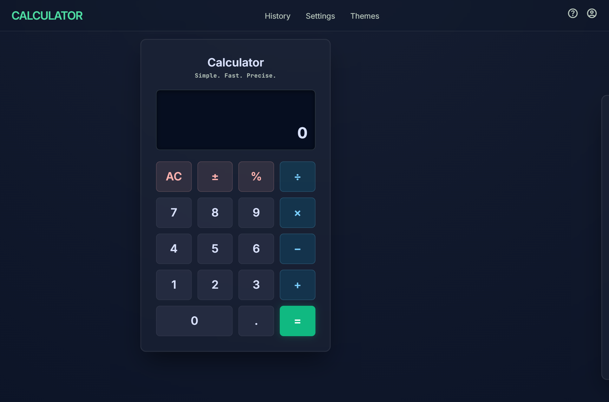

<p align="center">
  
</p>

<h1 align="center">WEBX — All-in-One Web</h1>

<p align="center">
  <strong>Your entire digital workspace — calculator, converters, productivity tools, and personal dashboards — unified in one beautiful glassmorphic web app.</strong>
</p>

<p align="center">
  <a href="https://webx-all-in-one.vercel.app/">Live Demo</a> &nbsp;|&nbsp; <a href="#-features">Features</a> &nbsp;|&nbsp; <a href="#%EF%B8%8F-tech-stack">Tech Stack</a> &nbsp;|&nbsp; <a href="#%EF%B8%8F-getting-started">Getting Started</a>
</p>

---

WEBX is a premium, all-in-one web workspace that replaces dozens of standalone tools with a single, cohesive application. It combines a powerful scientific calculator, unit and currency converters, time management tools, personal productivity features, and a fully customizable dashboard — all wrapped in an immersive glassmorphic UI with animated ambient backgrounds.

No accounts. No subscriptions. No tracking. Everything runs in your browser and persists locally.

---

## ✨ Features

### 🧮 Calculator

- **Basic & Scientific modes** — switch between a clean 4-function calculator and a full scientific keypad
- **Pratt parser expression evaluator** — safe mathematical parsing without `eval()`
- **20+ math functions** — sin, cos, tan, asin, acos, atan, sinh, cosh, tanh, sqrt, cbrt, log, ln, log2, abs, floor, ceil, round, exp, exp10, reciprocal
- **Factorial, powers, modulo, parentheses** — full operator support
- **Constants** — insert π and e
- **Memory operations** — store, recall, add, subtract, clear (MC / MR / M+ / M- / MS)
- **Angle units** — degrees, radians, gradians
- **Configurable precision** — 2 to 16 decimal places
- **Keyboard input** — type expressions directly with physical keyboard
- **Calculation history** — scrollable sidebar with recall, clear, and per-entry delete

### 🔄 Converters & Utilities

| Tool | Details |
|------|---------|
| **Unit Converter** | 16 categories: Length, Weight, Temperature, Area, Volume, Time, Speed, Data Storage, Pressure, Energy, Power, Angle, Frequency, Force, Torque, Fuel Efficiency |
| **Currency Converter** | 80+ currencies with live exchange rates, swap button, status indicator, and auto-refresh |
| **Percentage Tools** | 7 calculators: % of value, % change, discount, tax, tip, profit margin, markup |
| **Date & Time Tools** | 5 utilities: date difference, add/subtract from date, age calculator, business days between dates, Unix timestamp converter |
| **Weather** | Current conditions with 3-day forecast, city search with autocomplete, GPS auto-detect |

### ⏱️ Time & Productivity

- **Stopwatch** — start, stop, resume, lap tracking, clear laps
- **Countdown Timer** — hours/minutes/seconds input with 8 quick presets (1 min to 1 hr), pause, resume, reset
- **Alarms** — set alarms with hour/minute, optional label, repeat modes (once/daily/weekdays), custom ringtones via upload or 6 built-in tones, snooze, dismiss
- **World Clock** — add multiple cities, live-updating times with timezone display
- **Focus / Pomodoro** — configurable durations (15/25/45/60 min), play/pause/stop, SVG ring progress, daily & weekly stats, automatic 5-minute breaks (15 min after 4 sessions)
- **Tasks** — create tasks with title, notes, due date, priority (low/medium/high), category; filter by status (all/todo/in progress/completed/overdue); sort by created/due/priority/name; search
- **Reminders** — set reminders with time, optional date, repeat modes; fires browser notifications + sound
- **Goals** — set targets with description, unit, and progress tracking; increment by 1 or 10

### 📝 Personal Workspace

- **Notes** — create notes with title, body, and tags; pin, archive, search; filter by all/active/pinned/archived
- **Expense Tracker** — log expenses with amount, category (8 types), note, date, currency; view monthly totals and transaction counts
- **Activity Log** — automatic activity feed tracking tasks, reminders, notes, focus sessions, goals, and expenses (max 200 entries)
- **Global Search** — search across tasks, notes, reminders, goals, expenses, and history from a single search modal (Ctrl+K / Cmd+K)
- **Dashboard ("My Day")** — 10+ live widgets: weather, last calculation, today's tasks, focus stats, monthly expenses, active goals, next alarm, stopwatch, timer, recent notes
- **Profile** — set display name, preferred theme, preferred currency, creation date
- **Backup & Restore** — export all data as JSON, import from file, or reset all local data

### 🎨 Personalization

- **8 themes** — Midnight, Aurora, Ocean, Arctic, Sunset, Ember, Cyber, Minimal
- **Light / Dark / System mode** — full light theme support with proper glass adjustments
- **7 accent colors** — Emerald, Purple, Blue, Cyan, Pink, Orange, Red
- **Quick Settings panel** — toggle theme, appearance, accent, clock format, angle unit, notifications, and reduce motion from one dropdown
- **Ambient animated background** — canvas particle system with mouse-reactive dots that adapt to time of day (morning/afternoon/evening/night)
- **Sound effects** — 7 distinct UI sounds (click, navigate, open, success, start, complete) via Web Audio API
- **Haptic feedback** — vibration on supported devices
- **Animation intensity** — off, reduced, or normal
- **Reduce motion** — respects `prefers-reduced-motion` and provides manual toggle
- **6 built-in ringtones** — default, digital, bell, soft, classic, chime + custom upload via IndexedDB

### 🖥️ Command Bar

A universal command bar (accessible from the dashboard) that supports:

- **Natural language intents** — type things like "2+2", "add task Buy milk", "remind me to call", "25 min focus session", "start timer 5min", "set alarm for 7:30 AM", "add expense $50 for lunch"
- **15 quick commands** — Calculator, Tasks, Notes, Reminders, Focus, Goals, Expenses, Convert, Stopwatch, Timer, Alarm, Clock, Themes, Settings, Help
- **Navigation shortcuts** — "go to calculator", "open notes", "show tasks"
- **Math evaluation** — type expressions directly to get instant results

---

## 🚀 Demo

**Live:** [https://webx-all-in-one.vercel.app/](https://webx-all-in-one.vercel.app/)

---

## 🖥️ Screenshots

<p align="center">
  
</p>

<p align="center"><em>Add additional screenshots to showcase different views and themes.</em></p>

---

## 🛠️ Tech Stack

| Layer | Technology |
|-------|-----------|
| **Markup** | HTML5 |
| **Styling** | Custom CSS (1,700+ lines) + Tailwind CSS (CDN) |
| **Logic** | Vanilla JavaScript (3,900+ lines, IIFE pattern) |
| **Icons** | Material Symbols Outlined (Google Fonts) |
| **Typography** | Inter, Nunito, JetBrains Mono (Google Fonts) |
| **Fonts/Icons CDN** | Google Fonts API |
| **Tailwind CDN** | `cdn.tailwindcss.com` with custom theme config |
| **Local Server** | PowerShell HTTP server (`server.ps1`) for development |

**Architecture:** Single-page application with zero build steps. All JavaScript runs inside one IIFE with 30+ modules managed through plain objects and a single `ExpressionParser` class. No frameworks, no bundlers, no transpilers.

---

## 📁 Project Structure

```
WEBX---ALL-IN-ONE/
├── index.html          # Single HTML file (1,200+ lines) — all views, modals, nav, and markup
├── css/
│   └── styles.css      # Design system (1,700+ lines) — 8 themes, glassmorphism, responsive, animations
├── js/
│   ├── app.js          # Application engine (3,900+ lines) — all modules, managers, UI controllers
│   └── firebase-config.js  # Legacy config (unused, Firebase was removed)
├── screen.png          # Project screenshot
├── DESIGN.md           # Design system specification document
├── server.ps1          # PowerShell local dev server (port 8080)
└── .env.example        # API endpoint reference (no secrets required)
```

### Module Architecture (inside `app.js`)

| Category | Modules |
|----------|---------|
| **Core** | `StorageManager`, `SettingsManager`, `ProfileManager`, `ThemeManager`, `HistoryManager` |
| **Calculator** | `ExpressionParser`, `Evaluator`, `Calculator` |
| **Converters** | `UnitConverter`, `CurrencyService`, `PercentageTools`, `DateTimeTools` |
| **Time & Weather** | `LiveClock`, `WorldClockManager`, `Stopwatch`, `Timer`, `AlarmManager`, `WeatherService` |
| **Productivity** | `TaskManager`, `ReminderManager`, `NoteManager`, `FocusManager`, `GoalManager`, `ExpenseManager` |
| **UI Controllers** | `UIController`, `TasksUI`, `NotesUI`, `RemindersUI`, `FocusUI`, `GoalsUI`, `ExpensesUI` |
| **Infrastructure** | `DashboardManager`, `FavoritesManager`, `ActivityManager`, `CommandBar`, `IntentParser`, `GlobalSearch`, `SoundManager`, `AmbientEnvironment`, `RingtoneManager` |

---

## ⚙️ Getting Started

### Prerequisites

- A modern web browser (Chrome, Firefox, Edge, Safari)
- PowerShell (Windows) for the local development server — OR any static file server of your choice

### Quick Start

```bash
# Clone the repository
git clone https://github.com/saiganesh-007/WEBX---ALL-IN-ONE.git
cd WEBX---ALL-IN-ONE
```

**Option A — PowerShell (Windows):**

```powershell
.\server.ps1
# Opens at http://localhost:8080
```

**Option B — Any static file server:**

```bash
# Using Python
python -m http.server 8080

# Using Node.js (npx)
npx serve .

# Using PHP
php -S localhost:8080
```

Then open `http://localhost:8080` in your browser.

> **Note:** The app must be served over HTTP, not opened as a local file (`file://`), due to browser security restrictions on API fetch requests.

### Production

No build step required. Deploy the entire project directory to any static hosting platform:

```bash
# Deploy to Vercel
vercel deploy

# Deploy to Netlify
netlify deploy --prod --dir .
```

---

## 🔐 Environment Variables

**No environment variables are required.** All APIs used are keyless and free.

The `.env.example` file documents the API endpoints for reference:

| API | Purpose | Key Required |
|-----|---------|:------------:|
| `open.er-api.com` | Live currency exchange rates | No |
| `api.open-meteo.com` | Weather forecast data | No |
| `geocoding-api.open-meteo.com` | City name search / geocoding | No |
| `api.bigdatacloud.net` | Reverse geocoding (GPS → city name) | No |

---

## 💾 Data & Privacy

### Storage

All user data is stored **entirely in your browser** using:

- **localStorage** — 22 keys covering settings, themes, tasks, notes, reminders, goals, expenses, alarms, world clocks, history, focus sessions, and more
- **IndexedDB** — used exclusively for custom ringtone audio file uploads (`ringtone_db`)

### What is stored

| Data Type | Storage Key |
|-----------|-------------|
| Calculator history | `gc_history` |
| App settings | `gc_settings` |
| Theme & accent | `gc_theme`, `gc_accent` |
| Profile | `gc_profile` |
| Calculator memory | `gc_memory` |
| Currency cache | `gc_currency_cache` |
| Alarms | `gc_alarms` |
| World clocks | `gc_world_clocks` |
| Last GPS location | `gc_last_location` |
| Tasks | `gc_tasks` |
| Reminders | `gc_reminders` |
| Notes | `gc_notes` |
| Goals | `gc_goals` |
| Focus sessions | `gc_focus_sessions` |
| Focus daily totals | `gc_focus_daily` |
| Expenses | `gc_expenses` |
| Activities | `gc_activities` |
| Favorites | `gc_favorites` |

### Privacy

- **No accounts or authentication** — everything is anonymous and local
- **No data is sent to any server** — the only network requests are to public weather and currency APIs (which receive only city names or currency codes, never personal data)
- **No cookies or tracking** of any kind
- **Import/Export** — back up all your data as a single JSON file and restore it on any browser

### If browser storage is cleared

All data is permanently lost. Use the **Export** feature in the Profile modal to create backups.

---

## 🌐 APIs & External Services

| Service | Purpose | API Key | Fallback |
|---------|---------|:-------:|----------|
| [Open Exchange Rates](https://open.er-api.com/) | Currency exchange rates | No | Built-in fallback rates for 18 major currencies |
| [Open-Meteo](https://open-meteo.com/) | Weather forecasts | No | Error message displayed |
| [Open-Meteo Geocoding](https://open-meteo.com/docs/geocoding) | City search for weather & world clocks | No | Manual timezone entry |
| [BigDataCloud](https://www.bigdatacloud.com/) | Reverse geocoding (GPS coordinates → city name) | No | "Current Location" label used |

All APIs are free, keyless, and rate-limited. The app gracefully handles API failures with cached data and fallback behavior.

---

## 🎨 Themes & Customization

### Themes (8)

| Theme | Accent | Character |
|-------|--------|-----------|
| Midnight | `#a882ff` | Deep purple on dark navy — default |
| Aurora | `#4fd1c5` | Teal on deep blue |
| Ocean | `#38bdf8` | Sky blue on near-black blue |
| Arctic | `#67e8f9` | Cyan on cool slate |
| Sunset | `#fb923c` | Orange on warm brown |
| Ember | `#f87171` | Red on warm red-black |
| Cyber | `#60a5fa` | Blue on deep blue-black |
| Minimal | `#a0a0a0` | Neutral gray on pure dark |

### Accent Colors (7)

Emerald · Purple · Blue · Cyan · Pink · Orange · Red

Each accent updates all CSS variables (`--accent-primary`, `--accent-secondary`, `--accent-glow`, `--accent-subtle`, `--tw-accent`) simultaneously.

### Appearance Modes

- **Dark** — deep backgrounds with translucent glass
- **Light** — light gray backgrounds with white-tinted glass
- **System** — follows OS preference

### Configurable Settings

| Setting | Options |
|---------|---------|
| Decimal precision | 2, 4, 8, 12, 16 |
| Thousands separator | On / Off |
| Show expression | On / Off |
| Keyboard input | On / Off |
| Date format | Short / Medium / Long |
| Button sound | On / Off |
| Haptic feedback | On / Off |
| Timer sound | Default / Digital / Bell / None |
| Alarm ringtone | Default / Digital / Bell / Soft / Classic / Chime + Custom upload |
| Snooze duration | 3, 5, 10, 15 minutes |
| Save history | On / Off |
| Max history items | 50, 100, 200, 500 |
| Auto-refresh currency | On / Off |
| Weather unit | Celsius / Fahrenheit |
| Notifications | On / Off |
| Reduce motion | On / Off |
| Animation intensity | Off / Reduced / Normal |
| Appearance mode | Dark / Light / System |
| Clock format | 12h / 24h |
| Angle unit | DEG / RAD / GRAD |

---

## ⌨️ Keyboard Shortcuts

### Calculator

| Shortcut | Action |
|----------|--------|
| `0`–`9` | Append digit |
| `.` | Append decimal point |
| `+` `-` `*` `/` | Append operator |
| `(` `)` | Append parenthesis |
| `%` | Calculate percentage |
| `Enter` or `=` | Evaluate expression |
| `Backspace` | Delete last character |
| `Escape` | Clear calculator (or close modal) |

### Global

| Shortcut | Action |
|----------|--------|
| `Ctrl+K` / `Cmd+K` | Open global search |
| `Escape` | Close active modal or search |

> Keyboard input is only active when no form field is focused and the "Keyboard Input" setting is enabled.

---

## 📱 Responsive Design

The application adapts across all screen sizes:

| Breakpoint | Behavior |
|------------|----------|
| **Desktop (1024px+)** | Full top navigation, 3-column dashboard grid, side-by-side converter layouts |
| **Tablet (768px–1023px)** | Top navigation, 2-column dashboard, adjusted button sizing |
| **Mobile (< 768px)** | Bottom navigation bar with 6 tabs, simplified layouts, touch-friendly sizing, safe-area padding |
| **Small phone (< 380px)** | Further reduced padding and font sizes for very compact screens |

- The mobile bottom nav replaces the desktop top nav automatically
- Calculator buttons scale with `clamp()` for fluid sizing
- Converter layouts stack vertically on narrow screens
- Modals adapt to screen height with scrollable content

---

## ♿ Accessibility

- **Keyboard navigation** — all interactive elements are focusable; calculator fully operable via keyboard
- **`:focus-visible` outlines** — 2px accent-colored outlines appear on keyboard focus
- **Screen reader support** — `.sr-only` utility class for off-screen labels; ARIA labels on calculator buttons
- **Reduced motion** — respects `prefers-reduced-motion` media query; manual toggle in settings; hides ambient particles, disables transitions
- **Semantic HTML** — proper `<button>`, `<input>`, `<select>`, `<label>`, `<form>` usage throughout
- **Touch targets** — buttons sized at minimum 44px for mobile tap areas
- **No color-only indicators** — priority levels use text labels alongside colors

---

## 📦 Build & Deployment

### No Build Step

WEBX is a zero-build-step application. There is no `package.json`, no bundler, no transpiler. The source files are served directly.

### Deployment

The live version is deployed on **Vercel**: [https://webx-all-in-one.vercel.app/](https://webx-all-in-one.vercel.app/)

To deploy your own instance:

```bash
# Vercel
vercel deploy

# Netlify
netlify deploy --prod --dir .

# Cloudflare Pages, GitHub Pages, or any static host
# Just upload the project directory
```

---

## 🧪 Testing

There are no automated tests, test frameworks, or linting configuration in the project currently.

The app can be manually tested by:
1. Running the local server (`.\server.ps1`)
2. Testing each view panel and feature
3. Verifying localStorage persistence across page reloads
4. Testing responsive layouts at different viewport widths

---

## 🗺️ Roadmap / Future Improvements

Potential areas for future development:

- **Graphing calculator** — plot mathematical functions with interactive pan/zoom
- **Markdown notes** — rich text editing with markdown preview
- **Recurring expenses** — automated recurring transaction logging
- **Calendar integration** — monthly/weekly calendar view for tasks and reminders
- **Data visualization** — charts for expense breakdowns and focus statistics
- **PWA support** — service worker for offline use and home screen installation
- **Import from other apps** — support for importing data from popular task/note apps
- **Custom themes** — user-defined color themes beyond the built-in presets
- **Unit tests** — add Vitest or Jest for core calculation logic
- **TypeScript migration** — add type safety to the module system

---

## 🤝 Contributing

Contributions are welcome! Here's how to get started:

1. **Fork** the repository
2. **Create** a feature branch
   ```bash
   git checkout -b feature/your-feature-name
   ```
3. **Make** your changes
4. **Test** locally using the PowerShell dev server or any static file server
5. **Commit** with a clear message
   ```bash
   git commit -m "Add: description of your change"
   ```
6. **Push** to your fork
   ```bash
   git push origin feature/your-feature-name
   ```
7. **Open** a Pull Request with a description of what you changed and why

### Guidelines

- No external frameworks or build tools — keep the zero-dependency philosophy
- Follow the existing code style (IIFE pattern, `const` modules, no `eval()`)
- All user data must remain in localStorage/IndexedDB — no backend required
- Test on both desktop and mobile viewports
- Ensure all themes and light/dark modes still work

---

## 📄 License

No license is currently specified for this project. All rights reserved by default.

If you'd like to use, modify, or distribute this project, please contact the repository owner or add an appropriate open-source license.

---

## 🙌 Acknowledgements

- [Tailwind CSS](https://tailwindcss.com/) — utility-first CSS framework (CDN)
- [Google Fonts](https://fonts.google.com/) — Inter, Nunito, JetBrains Mono typefaces
- [Material Symbols](https://fonts.google.com/icons) — icon library
- [Open-Meteo](https://open-meteo.com/) — free weather and geocoding API
- [Open Exchange Rates](https://open.er-api.com/) — free currency exchange rate API
- [BigDataCloud](https://www.bigdatacloud.com/) — free reverse geocoding API
- Inspired by glassmorphism design principles and modern workspace aesthetics

---

<p align="center">
  <strong>One web app. Every tool. One workspace.</strong>
</p>
